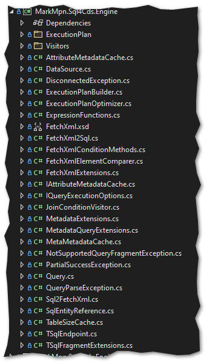
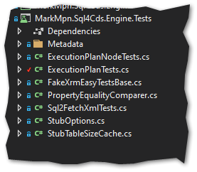

# SQL4CDS Engine to .NET5 (Core)

Changes made to run SQL4CDS Engine on .NET5 (Core)

## MarkMpn.Sql4Cds.Engine.csproj
We need a .NET5 library here, so a new (basic) library project (targeting .NET5) was created.
```xml
<Project Sdk="Microsoft.NET.Sdk">

	<PropertyGroup>
		<TargetFramework>net5.0</TargetFramework>
		<GeneratePackageOnBuild>true</GeneratePackageOnBuild>
		<Version>5.3.1</Version>
	</PropertyGroup>

	<ItemGroup>
		<PackageReference Include="Microsoft.Dynamics.Sdk.Messages" Version="0.5.10" />
		<PackageReference Include="Microsoft.Extensions.Configuration.Json" Version="5.0.0" />
		<PackageReference Include="Microsoft.PowerPlatform.Dataverse.Client" Version="0.5.10" />
		<PackageReference Include="Microsoft.PowerPlatform.Dataverse.Client.Dynamics" Version="0.5.10" />
		<PackageReference Include="Microsoft.SqlServer.TransactSql.ScriptDom" Version="150.4897.1" />
		<PackageReference Include="System.Data.SqlClient" Version="4.8.3" />
	</ItemGroup>

	<ItemGroup>
		<AssemblyAttribute Include="System.Runtime.CompilerServices.InternalsVisibleToAttribute">
			<_Parameter1>MarkMpn.Sql4Cds.Engine.Tests</_Parameter1>
		</AssemblyAttribute>
	</ItemGroup>

</Project>
```
All Files from `MarkMpn.Sql4Cds.Engine` were copied to the new project, except folder `Properties` and files `MarkMpn.Sql4Cds.Engine.nuspec` and `Key.snk`. Also omit the `.csproj` file!



## Code Replacements
The following code replacements must be done over the whole project:
- Replace `CrmConnectOrgUriActual` with `ConnectedOrgUriActual`
- Replace `CrmServiceClient` with `ServiceClient` 

The follwing code must be deleted from the whole project (tipp: replace with ""):
- `using Microsoft.Xrm.Tooling.Connector;`

## Additional using
Add `using Microsoft.PowerPlatform.Dataverse.Client;` to the following files:
- `BaseDmlNode.cs`
- `ExecuteAsNode.cs`
- `RevertNode.cs`
- `SqlNode.cs`
- `UpdateNode.cs`
- `TSqlEndpoint.cs`

## File specific code changes
### `ExecutionPlan.BaseDmlNode.cs`
Add 
```csharp
using AuthenticationType = Microsoft.PowerPlatform.Dataverse.Client.AuthenticationType;
```
Change Line no. 349 to 
```csharp
if (maxDop <= 1 || svc == null || svc.ActiveAuthenticationType != AuthenticationType.OAuth)
```
### `ExecutionPlan.ExecuteAsNode.cs`
Since `Microsoft.PowerPlatform.Dataverse.Client` does no longer support `OrganizationServiceProxy` it is necessary to change the if-block in the `Execute()`-method (original line no. 64) from
```csharp
if (dataSource.Connection is Microsoft.Xrm.Sdk.Client.OrganizationServiceProxy svcProxy)
    svcProxy.CallerId = userId;
else if (dataSource.Connection is Microsoft.Xrm.Sdk.WebServiceClient.OrganizationWebProxyClient webProxy)
    webProxy.CallerId = userId;
else if (dataSource.Connection is CrmServiceClient svc)
    svc.CallerId = userId;
else
    throw new QueryExecutionException("Unexpected organization service type");
```
… to …
```csharp
if (dataSource.Connection is Microsoft.Xrm.Sdk.WebServiceClient.OrganizationWebProxyClient webProxy)
    webProxy.CallerId = userId;
else if (dataSource.Connection is ServiceClient svc)
    svc.CallerId = userId;
else
    throw new QueryExecutionException("Unexpected organization service type");
```
### ExecutionPlan.RevertNode.cs
The same changes as shown above have to be made to this file. So change the if-block in the `Execute()`-method (original line no. 56) from 
```csharp
if (dataSource.Connection is Microsoft.Xrm.Sdk.Client.OrganizationServiceProxy svcProxy)
    svcProxy.CallerId = userId;
else if (dataSource.Connection is Microsoft.Xrm.Sdk.WebServiceClient.OrganizationWebProxyClient webProxy)
    webProxy.CallerId = userId;
else if (dataSource.Connection is CrmServiceClient svc)
    svc.CallerId = userId;
else
    throw new QueryExecutionException("Unexpected organization service type");
```
… to …
```csharp
if (dataSource.Connection is Microsoft.Xrm.Sdk.WebServiceClient.OrganizationWebProxyClient webProxy)
    webProxy.CallerId = userId;
else if (dataSource.Connection is ServiceClient svc)
    svc.CallerId = userId;
else
    throw new QueryExecutionException("Unexpected organization service type");
```
### Query.cs
Due to some issiues with `SqlEntityReference`, line no. 88 in method `DataTableToEntityCollection()` has to be changed from a simple
```csharp
value = value.GetType().GetProperty("Value").GetValue(value);
```
… to a more differentiated …
```csharp
{
    value = value is SqlEntityReference reference
        ? reference.Id 
        : value.GetType().GetProperty("Value").GetValue(value);
}
```
### SqlEntityReference.cs
This might not be just a problem when porting to .NET5 but in some cases the getter for `Id` throws an exception when the `_guid.value` is null so the getter in line no. 44 has to be changed to this
```csharp
public Guid Id => IsNull ? Guid.Empty : _guid.Value;
```

## MarkMpn.Sql4Cds.EngineTests.csproj
We need a .NET5 MS-Test project, here so a new one was created.
```xml
<Project Sdk="Microsoft.NET.Sdk">

	<PropertyGroup>
		<TargetFramework>net5.0</TargetFramework>
		<IsPackable>false</IsPackable>
	</PropertyGroup>

	<ItemGroup>
		<PackageReference Include="FakeXrmEasy.9.NetCore" Version="1.57.10" />
		<PackageReference Include="Microsoft.NET.Test.Sdk" Version="16.9.4" />
		<PackageReference Include="MSTest.TestAdapter" Version="2.2.3" />
		<PackageReference Include="MSTest.TestFramework" Version="2.2.3" />
		<PackageReference Include="coverlet.collector" Version="3.0.2" />
		<PackageReference Include="Microsoft.Dynamics.Sdk.Messages" Version="0.5.10" />
		<PackageReference Include="Microsoft.PowerPlatform.Dataverse.Client" Version="0.5.10" />
		<PackageReference Include="Microsoft.PowerPlatform.Dataverse.Client.Dynamics" Version="0.5.10" />
		<PackageReference Include="Microsoft.SqlServer.TransactSql.ScriptDom" Version="150.4897.1" />
		<PackageReference Include="System.Data.SqlClient" Version="4.8.3" />
	</ItemGroup>

	<ItemGroup>
		<ProjectReference Include="..\MarkMpn.Sql4Cds.Engine\MarkMpn.Sql4Cds.Engine.csproj" />
	</ItemGroup>

</Project>
```
All Files from `MarkMpn.Sql4Cds.Engine.Test` were copied to the new project, except folder `Properties` and files `*.config` and `Key.snk`. Also omit the `.csproj` file!



The `FakeXrmEasy.9.NetCore` package is an updated version of the [NetCore version of FakeXrmEasy](https://github.com/rentready/fake-xrm-easy/tree/master/FakeXrmEasy.9.NetCore) which is using Microsoft.PowerPlatform.Dataverse.Client as of version 0.5.10. [This package is provided here](https://github.com/miseeger/Dataverse.Sql/blob/main/Local.Nugets/FakeXrmEasy.9.NetCore.1.57.10.nupkg). Just klick 'download' and copy it to a local NuGet package folder.

## File specific code changes
### `ExecutionPlanTests.cs`
The only things to change in this file are:
Remove
```csharp
using Microsoft.Xrm.Tooling.Connector;
```
Add
```csharp
using MarkMpn.Sql4Cds.Engine;
using FetchXml = MarkMpn.Sql4Cds.Engine.FetchXml;
```
